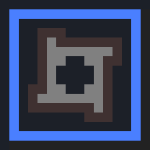

// suppress inspection "IgnoreUnusedEntry" for whole file

== GenDungeon

A text adventure where you explore procedurally generated worlds.

image::screenshot.png[GenDungeon gameplay screenshot]

=== Installation

GenDungeon is built with Electron using node.js and npm.

[source,npm]
----
npm install
----

=== Usage

GenDungeon can be run with:

[source,npm]
----
npm start
----

You can also run it with the developer console enabled for debugging with:

[source,npm]
----
npm test
----

=== Building

[source,npm]
----
electron-builder build
----

=== License

GenDungeon is licensed under link:LICENSE[GNU General Public License v3.0.]
