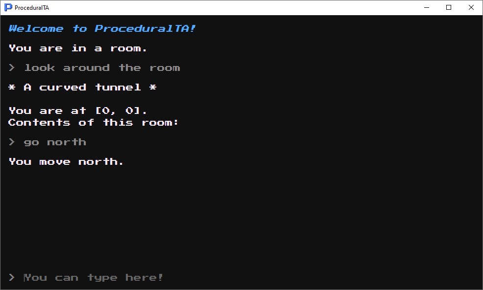

# ProceduralTA

A text adventure where you explore procedurally generated worlds.



## Installation

ProceduralTA is built with Electron using node.js and npm.

```
npm install
```

## Usage

ProceduralTA can be run with

```
npm start
```

You can also run it with developer console enabled for debugging with

```
npm test
```

## Building

```
electron-builder build
```


## License

ProceduralTA is licensed under [GNU General Public License v3.0.](LICENSE)